# Workplace Proxy — Architecture & Launch Deliverables

## System Architecture Diagram

This diagram visualizes the multi-agent design, data storage layers, client application flow, and the future integration scope.

```mermaid
graph TD
    subgraph Client ["Client App (React + TanStack Start)"]
        UI["Visual Interface (Tailwind v4)"]
        WebGL["WebGL Strands Canvas (OGL)"]
        Bridge["API Client & State Bridge"]
    end

    subgraph Data ["Persistence & Context Layers"]
        Supabase[("Supabase DB (PostgreSQL)
        - messages
        - calendar_blocks
        - trace_logs")]
        Qdrant[("Qdrant Vector Memory
        - User Context (Triggers, Formatting)
        - Corporate Context (Jargon, Vocabulary)")]
    end

    subgraph Backend ["FastAPI Agent Swarm Server"]
        Orch["Lyzr Swarm Orchestrator"]
        Debate["Consensus Debate Engine"]
        ADK["Google ADK + Gemini 2.0 Flash"]

        subgraph Swarm ["Agent Swarm Roles"]
            A1["Agent 1: Interceptor
            (Ingests Raw Signals)"]
            A2["Agent 2: Contextualizer
            (RAG Lookup in Qdrant)"]
            A3["Agent 3: Scheduler
            (MCP Calendar Slotting)"]
            A4["Agent 4: Twin Translator
            (Output Customization)"]
        end
    end

    subgraph Integrations ["MCP & Interface Layer"]
        MCP["Model Context Protocol Bridge"]
        MockAPI["Mock Workspace Webhooks
        (Slack, Calendar, Email)"]
    end

    subgraph Future ["Future Work Scope"]
        OAuth["Direct OAuth Interfaces"]
        RL["Reinforcement Feedback Loop
        (Rating Adjustments -> Qdrant)"]
        Sensory["Sensory Density Scale
        (Audio & Layout Density Toggles)"]
    end

    %% Flow lines
    MockAPI -->|Raw Webhook Trigger| Supabase
    MockAPI -.->|MCP Connection| MCP
    MCP <-->|Context Queries| A1
    
    UI -->|Render Data| Bridge
    Bridge -->|Fetch State| Supabase
    Bridge -->|Send Inputs| Orch

    Orch -->|A2A Coordination| Swarm
    A1 --> A2
    A2 <-->|RAG Query| Qdrant
    A3 <-->|Check Slots| MCP
    A2 & A3 & A4 <-->|Consensus Negotiation| Debate
    Debate -->|Gemini Inference| ADK
    
    ADK -->|Structured Action Task| Supabase
    
    %% Future flow connections
    OAuth -.->|Future Direct Connection| A1
    RL -.->|Continuous Training| Qdrant
    Sensory -.->|Dynamic Layouts| UI
    
    style WebGL fill:#003366,stroke:#00C6FF,stroke-width:1.5px
    style Qdrant fill:#1a3a1e,stroke:#10B981,stroke-width:1px
    style Supabase fill:#1a2b3a,stroke:#3B82F6,stroke-width:1px
    style Swarm fill:#2d1b40,stroke:#8B5CF6,stroke-width:1px
    style Future fill:#3a2020,stroke:#EF4444,stroke-width:1px
```



---

## LinkedIn Post Draft

Below is the draft of the LinkedIn post from a developer's perspective, incorporating the specified tags and BIT Bengaluru college mention.

```markdown
🚀 Building a Cognitive OS for Neurodivergent Deep Work!

I've been following the progress of @Anvi and @Shrey Vashistha as they actively build **Workplace Proxy** (formerly Project Clarity) for the @Google Agent Labs Hackathon, conducted by BIT Bengaluru.

Instead of another simple text template generator, they are building an active, protective "Communication Buffer" designed for neurodivergent professionals (ADHD/Autism) and anyone experiencing high cognitive load.

Here's the technical stack they are integrating:
🧠 **Lyzr Swarm Orchestrator**: Manages an asymmetric Agent-to-Agent (A2A) debate between four specialized Gemini-powered agents (Interceptor, Contextualizer, Scheduler, and Twin Translator) to translate messy corporate-speak into structured, actionable schedule blocks.
⚡ **Google ADK & Gemini 2.0 Flash**: Drives the high-speed reasoning engines behind their debate consensus loop.
💾 **Qdrant Vector Database**: Houses long-term personal formatting memory and organization jargon libraries to support real-time RAG context retrieval.
🔌 **Model Context Protocol (MCP)**: Hooks their agent framework directly into database feeds and simulated Slack/Email/Calendar layers.
🎨 **Next-Gen UX (React + Tailwind v4 + OGL WebGL)**: An ultra-clean, minimalist sidebar dashboard backed by a premium full-screen WebGL Strands background to visualize cognitive load levels in real time.

A massive shoutout to the @HiDevs Community and the organizers at BIT Bengaluru for putting together the @Google Agent Labs Hackathon and providing a platform to push the boundaries of agentic AI.

They are currently expanding on the core modules: adding direct Slack/Gmail OAuth interfaces and building a continuous reinforcement learning feedback loop from user rating adjustments.

Check out their architecture diagram and codebase below to see what they are building! 👇

#GoogleAgentLabs #AI #MultiAgentSwarm #Accessibility #Qdrant #Lyzr #ADK #SoftwareEngineering #BITBengaluru #HiDevs
```
